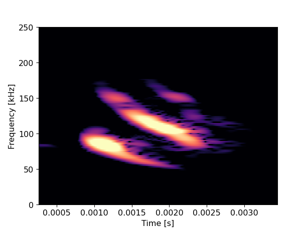

# Listen like a bat: plant species classification using echolocation with CNNs

Code for my Master's thesis at Queen Mary, UoL



## Dependencies:

````bash
$ pip install librosa==0.7.2 pandas==1.0.5 torch==1.5.1 numba==0.48
````
